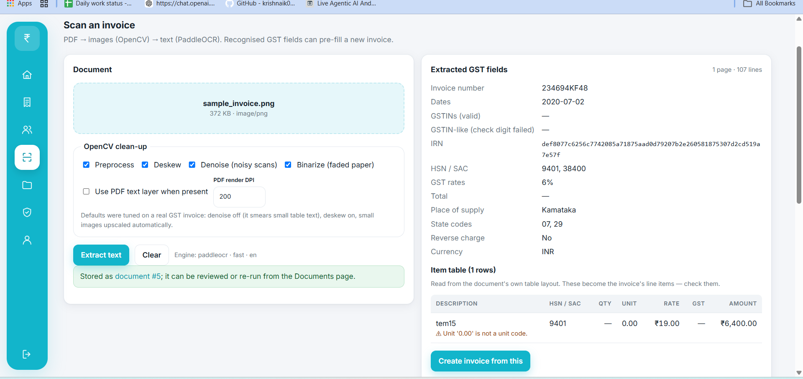

# E-Invoice Frontend

React + TypeScript single-page app for the [E-Invoice Backend](../E-Invoice-Backend-system): clients, GST
invoices with live CGST/SGST vs IGST preview, IRP readiness and INV-01 JSON, IRN recording, and
scanned-invoice intake through the backend's OCR pipeline.

## Stack

| Concern | Choice |
|---|---|
| Build / dev server | Vite 7 |
| UI | React 19, plain CSS (`src/styles.css`) |
| Routing | React Router 7 |
| Server state | TanStack Query 5 |
| API client | `fetch` wrapper (`src/api/client.ts`): in-memory bearer token, `{error, detail}` → `ApiError` |
| Resilience | `ErrorBoundary` around the router — a render error shows a panel, not a blank page |
| Bundle | Routes are `React.lazy` code-split; CI fails if the entry bundle passes its budget |
| Tests | Vitest + Testing Library; live API integration test (opt-in) |

---

## Connecting to the backend

The backend repo is expected as a sibling folder: `../E-Invoice-Backend-system`.

### Development — Vite proxy (no CORS setup)

```
browser ──► Vite :5173 ──/api──► FastAPI :8000
```

```bash
# terminal 1 — backend
cd ../E-Invoice-Backend-system && uvicorn app.main:app --reload

# terminal 2 — frontend
npm install
npm run dev            # http://localhost:5173
```

`vite.config.ts` proxies `/api` and `/health` to `http://127.0.0.1:8000`, so the app and the API share one
origin in the browser. Override the target with `VITE_PROXY_TARGET=http://127.0.0.1:8001 npm run dev`.

**One command for both:**

```bash
npm run dev:all        # Windows PowerShell → scripts/dev-all.ps1
npm run dev:all:sh     # macOS / Linux / Git Bash → scripts/dev-all.sh
```

The scripts start uvicorn from the sibling backend folder (using `C:\venvs\einvoice` or the backend's
`venv/` when present) and then Vite with the proxy pointed at it. Ports: `-BackendPort` / `-FrontendPort`
(PowerShell) or `BACKEND_PORT` / `FRONTEND_PORT` (bash). If 5173 is taken, pass another port.

### Production — served by the backend

```bash
npm run build          # → dist/
```

Then in the backend's `.env` set `FRONTEND_DIST=../E-Invoice-Frontend-System/dist` and run uvicorn. The
API serves `index.html` at `/` with history fallback, `dist/assets` under `/assets`, and keeps `/api`,
`/docs` and `/health`. One process, one origin, no CORS.

To host `dist/` elsewhere (S3, nginx, Netlify …) instead, build with the API origin baked in and add that
host to the backend's `ALLOWED_ORIGINS`:

```bash
VITE_API_BASE_URL=https://api.example.com npm run build
```

### Contract

The backend's OpenAPI document is the source of truth, and the frontend is checked against it twice:

1. **`npm run gen:api`** regenerates `src/api/schema.d.ts` from `../E-Invoice-Backend-system/docs/openapi.json`
   (or a URL / path you pass). The generated file is committed, and CI regenerates it and fails on a diff —
   so a backend change nobody regenerated for is caught.
2. **`src/api/contract.ts`** asserts, at compile time, that every hand-written type in `src/api/types.ts`
   has exactly the keys of the schema it mirrors. Rename a field on the server and `tsc` fails on that
   file naming the field, instead of a page rendering `undefined`.

The hand-written types stay because they carry the documentation and the narrower unions the pages rely
on; the generated file is what keeps them honest.

`src/lib/invoiceMath.ts` still duplicates the backend's rounding so the live totals match what gets saved
— the server's figures are the ones stored, and the e2e test checks the two agree to the paisa.

The rounding has to agree to the paisa. The backend computes in `Decimal` with `ROUND_HALF_UP`, which is
what `round2` here does with its `Number.EPSILON` nudge — Python's built-in `round()` is banker's rounding
and would disagree on exactly the values (`2.675`) a user is most likely to notice.

---

## Session tokens

The access token is held in a module variable in `src/api/client.ts` and is **never** written to
`localStorage`. The refresh token is not held by this app at all: the backend sets it as an `HttpOnly`
cookie scoped to `/api/v1/auth`, so neither this code nor any script injected into the page can read it.

That split is the point. An XSS bug that can read a seven-day refresh token is an account takeover; the
same bug against a thirty-minute access token buys a window that dies with the tab. The cost is that a page
reload starts with no token, so `AuthProvider` calls `refreshSession()` once on boot to trade the cookie
for a fresh access token before loading `/auth/me` — which is why the first paint shows a spinner even for
a signed-in user.

Two consequences worth knowing:

* every request sets `credentials: "include"`, because login, refresh and logout need the cookie (the path
  scope means nothing is actually attached to the other routes);
* signing out calls `POST /auth/logout` so the cookie is cleared server-side. Without it the cookie would
  outlive the session and the next reload would silently sign the user back in.

The only thing this app persists is `einvoice.workspace`, the workspace id an admin has switched to — a
preference, not a credential.

**Second factor.** `login()` in `AuthContext` resolves to `null` once a session exists, or to an `MfaChallenge`
when the account has TOTP enabled; the login page then asks for the code and calls `completeMfa`. Enrolment lives
on **Profile** (`MfaCard`): the otpauth URL is rendered as a QR with `src/components/QrCode.tsx`, the first code
confirms it, and the eight recovery codes are shown exactly once.

---

## Scripts

| Command | What it does |
|---|---|
| `npm run dev` | Vite dev server with `/api` proxy |
| `npm run dev:all` / `dev:all:sh` | Backend + frontend together |
| `npm run build` | Type-check + production bundle to `dist/` |
| `npm run gen:api` | Regenerate `src/api/schema.d.ts` from the backend's OpenAPI contract |
| `npm run preview` | Serve `dist/` locally |
| `npm test` | Unit tests (GST checksum, invoice math, OCR→invoice mapping, API client) |
| `npm run lint` | TypeScript type-check |

**Live integration test** — runs the real `src/api/endpoints.ts` against a running backend (register →
seller profile → client → invoice → readiness → INV-01 payload → IRN → lock; optional OCR upload):

```bash
E2E_BASE_URL=http://127.0.0.1:5173 VITE_API_BASE_URL=http://127.0.0.1:5173 npx vitest run e2e
# add E2E_OCR_FILE=path/to/invoice.pdf to include the OCR upload (~1 min)
```

---
### Scanning an invoice

A scanned document in, a reviewable draft out:

| Uploaded scan | What the backend extracted |
|---|---|
|  |  |

---

## Roles

The backend assigns every account a role — `admin`, `manager`, `engineer` or `client` — and enforces a permission
matrix (see the backend README). The frontend mirrors that matrix in `src/lib/permissions.ts` purely to show or hide
controls: `can(user, "invoices:delete")` decides whether a Delete button renders, `ProtectedRoute permission="…"`
guards whole routes, and the sidebar only lists pages the role can open.

| Role | What they see in the UI |
|---|---|
| admin | Everything a manager has, plus a **workspace switcher** in the sidebar: pick another owner and every page shows and edits *their* data (the API client sends `X-Workspace-Id`); a banner shows whose workspace is open |
| manager | Everything in their own workspace, plus **Users & roles** (`/users`) to add engineers, client users and managers, and the **Audit trail** (`/audit`) |
| engineer | Dashboard, invoices, clients, OCR. No delete buttons, no IRN form, no seller-profile fields, no audit trail |
| client | Dashboard and invoices for their own client only; the Clients page shows just their record; no OCR, no create/edit |

Self-registration creates a manager (the very first account becomes admin; the backend can turn self-registration
off with `ALLOW_SELF_REGISTRATION=false`). Engineers and client users are created from **Users & roles**; the manager
sets an initial password and shares it, and can reset it later from the same page. Everyone can change their own
password on **Profile**. Members see their manager's GST seller details (via `GET /users/workspace`) so the live tax
split on the invoice form matches what the backend computes.

## Pages

| Route | What it does | Backend endpoints |
|---|---|---|
| `/login`, `/register`, `/forgot-password`, `/reset-password` | JWT auth. The access token lives in memory only; the refresh token is an `HttpOnly` cookie the browser keeps and no script can read — see [Session tokens](#session-tokens). A 401 triggers one silent `POST /auth/refresh` and retries the call; if that fails the session is cleared | `POST /auth/login`, `POST /auth/register`, `POST /auth/refresh`, `POST /auth/logout`, `POST /auth/forgot-password`, `POST /auth/reset-password`, `GET /auth/me` |
| `/` Dashboard | Stat cards, then a master-detail view: invoice cards on the left (status filter, **New +**), a printable invoice preview on the right (seller block, client, total / paid / balance due, items, totals) with **Print** and **Open** | `GET /invoices/stats`, `GET /invoices/`, `GET /invoices/:id` |
| `/profile` | Seller profile (`SellerDtls`) with live GSTIN check-digit validation and a "still needed for IRP" list; change password; **two-factor authentication** (enrol with a QR, recovery codes shown once, disable with a code); **this workspace's own IRP credentials** (owners) | `PATCH /users/me`, `GET /gst/validate-gstin`, `GET /gst/state-codes`, `/auth/mfa/*`, `/invoices/irp/credentials` |
| `/clients` | Buyers with GSTIN / state / place of supply; create, edit, delete | `/clients` CRUD |
| `/invoices` | Paginated list, status filter, number search, IRN badge | `GET /invoices/` |
| `/invoices/new`, `/invoices/:id/edit` | Full GST form: document type, supply type, reverse charge, IGST-on-intra, place of supply, preceding document for notes, ship-to / dispatch-from, line items with HSN/SAC, unit, discount and rate; **live totals with the tax split** | `POST /invoices/`, `PATCH /invoices/:id` |
| `/invoices/:id` | Detail (the IRP's **signed QR rendered as an image** on the printable invoice, as the GST rules require; download of the **filed INV-01** frozen at registration), status change (dropdown offers only the backend's `allowed_status_transitions`), link to the scanned source document, delete; **e-invoice panel**: readiness checklist with fix links, INV-01 JSON (copy / download), record IRN + ack + signed QR; locked after IRN | `/einvoice/readiness`, `/einvoice`, `/irn` |
| `/ocr` | Drag-and-drop PDF / image, OpenCV options, extracted GST fields, and the **item table rebuilt from the page layout** (description, HSN, qty, rate, GST %, amount) with a warning on any row whose arithmetic does not reconcile. **Create invoice from this** pre-fills the form from those rows, incl. `document_id` and `source_reference`, and pre-selects a client by GSTIN. The upload returns immediately and the page polls the document until it is `processed` or `failed` — see [Long-running OCR](#long-running-ocr) | `GET /ocr/status`, `POST /documents/`, `GET /documents/:id` |
| `/documents` | Every stored upload with status (processed / failed), engine, pages and the invoice it produced; open the file, re-run OCR, create an invoice from a processed scan, delete (blocked while linked) | `/documents` CRUD, `POST /documents/:id/retry`, `GET /documents/:id/file` |
| `/audit` | Append-only audit trail (managers and admins): who changed what and when, filterable by action, record type and date, each row expandable to the before/after values, plus a CSV export of the current filter. Admins can widen the scope to every workspace | `GET /audit/`, `GET /audit/actions`, `GET /audit/export.csv` |

---

## Long-running OCR

Recognising a page takes tens of seconds, and a 20-page PDF takes minutes. The frontend never waits that
out on an open connection:

```
POST /documents/          -> 202 { id, status: "pending" }     (returns in ~250ms)
GET  /documents/{id}      -> status: "pending"  … poll every 2s
GET  /documents/{id}      -> status: "processed" | "failed"
```

`OcrPage` does this with a TanStack Query whose `refetchInterval` stops as soon as the status leaves
`pending`, so polling ends by itself. A `failed` document shows the reason and points at
`/documents`, where it can be retried against the stored file — the upload is never lost.

`ocrApi.extract` still exists and does the whole parse in one synchronous call. It is kept for scripts
and the live integration test; the UI does not use it.

### Reading the extracted table

The backend rebuilds the invoice's item table from the OCR box layout and returns one row per line item,
each with the OCR confidence behind it and a list of `warnings`. A row is flagged rather than hidden when
it cannot be true — `quantity x rate` not reaching the printed amount, a GST rate that is not a real slab,
a unit column holding a number. `ocrToInvoiceDraft` still uses those rows to pre-fill the invoice form,
because a row the user can see and correct beats an empty draft with no explanation.

When the engine returns no box positions — a PDF text layer, or the LlamaParse backend — there is no
layout to rebuild, `line_items` comes back empty, and the draft falls back to spreading the document
total across the HSN codes it found.

## Continuous integration

`.github/workflows/ci.yml`:

| Step | What it proves |
|---|---|
| `npm audit --audit-level=high` | No known high/critical CVEs in what ships or builds |
| `npm run gen:api` + `git diff --exit-code` | `src/api/schema.d.ts` matches the backend's committed contract |
| `npm run lint` (`tsc`) | Types compile — including `src/api/contract.ts`, which fails if a hand-written type drifts from the schema |
| `npm test` · `npm run build` | The suite passes and the bundle builds |
| Entry bundle ≤ 340 KB | Code-splitting has not regressed |
| `gitleaks` (separate job) | No credential in the history — a `VITE_*` secret ends up in every visitor's bundle |
| `e2e` (separate job) | The API layer against a live backend: auth, refresh cookie, seller profile, client, invoice, INV-01, IRN, RBAC |

The contract step checks out the backend repository beside this one (sparse, just `docs/openapi.json`),
the same layout `npm run gen:api` assumes on a developer machine. The `e2e` job goes further: it checks out
the whole backend, starts it, and runs `src/test/e2e.api.test.ts` against it — the one place the two
repositories are proven to agree at runtime rather than only at the type level.

Both repositories are private, so these cross-repo checkouts need a repository secret **`BACKEND_REPO_TOKEN`**:
a fine-grained personal access token with read access to `E-Invoice-Backend-system`'s contents. Without it
the `build` job's contract step and the `e2e` job fail at checkout.

## Look and feel

The UI follows a teal invoice-management template: a floating icon rail on the left (tooltips on hover, collapses
to a top strip under 900 px), a top bar with the brand, the current page name, the admin workspace switcher and an
avatar menu, and rounded white cards on a light grey ground. `src/components/InvoicePreview.tsx` renders the
"paper" invoice used on the dashboard and the detail page; `@media print` hides everything else, so **Print** on
either page produces a clean invoice printout / PDF. Icons are inline SVGs in `src/components/icons.tsx`
(no icon library); the font is Inter from Google Fonts with a system fallback.

## Structure

```
src/
├── api/
│   ├── client.ts        fetch wrapper: base URL, in-memory access token, ApiError, auth:expired event
│   ├── endpoints.ts     authApi, usersApi, clientsApi, invoicesApi, gstApi, documentsApi, ocrApi, auditApi
│   ├── types.ts         hand-written mirrors of the backend schemas (documented, narrow unions)
│   ├── schema.d.ts      GENERATED from the backend's OpenAPI contract — npm run gen:api
│   └── contract.ts      compile-time assertions that types.ts matches schema.d.ts
├── auth/AuthContext.tsx session restore from the refresh cookie + current user
├── lib/
│   ├── gst.ts           GSTIN mod-36 check digit, pincode/HSN formats, rate & UQC options
│   ├── invoiceMath.ts   live totals preview (mirrors backend rounding)
│   ├── ocrToInvoice.ts  OCR fields → invoice draft
│   └── format.ts        INR money, DD/MM/YYYY dates, IRN shortening
├── components/          Layout, ProtectedRoute, ErrorBoundary, ui primitives, StateCodeSelect, GstinInput
├── App.tsx              routes; every page below the auth screens is lazy-loaded
├── pages/               one file per route (each becomes its own bundle chunk)
└── test/                unit tests + e2e.api.test.ts (opt-in live test)
scripts/dev-all.ps1|sh   start backend + frontend together
```

Validation happens twice on purpose: instantly in the browser (GSTIN check digit, HSN length, due-date
ordering, credit-note prerequisites, line discounts) and authoritatively on the server, whose `422`
bodies the API client flattens into a readable sentence.

## Notes

- **OneDrive**: `node_modules/` inside a synced folder is slow and can develop cloud-placeholder files.
  Clone outside OneDrive for day-to-day development if you can.
- OCR runs on the backend at roughly a minute per page on CPU. The upload returns straight away and the
  page polls for the result, so nothing depends on a browser or proxy holding a request open that long.
- If port 5173 is busy, run `npx vite --port 5180` (the proxy still targets the backend).
- Opening a stored document uses `fetch` with the auth header and an object URL, because a plain `<a href>`
  cannot carry the Bearer token. The object URL is built with the document's own content type only when it is
  one the backend accepts (PDF or image); anything else is handed over as `application/octet-stream`. A `blob:`
  URL inherits *this* origin, where the session token lives, so the type it opens with decides whether the tab
  renders a document or executes a payload.
